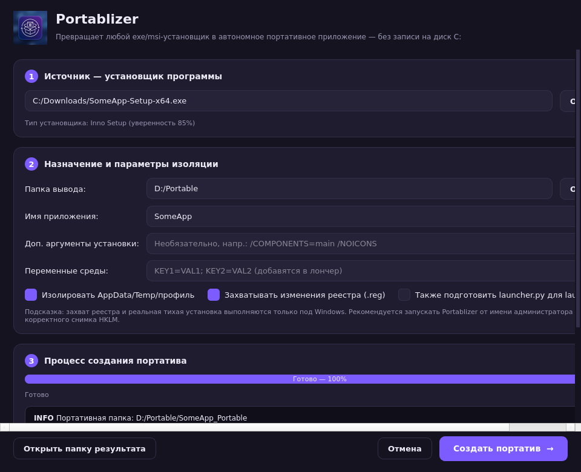

# Portablizer

**Portablizer** — приложение с современным графическим интерфейсом (PySide6/Qt),
которое превращает **любой exe/msi-установщик** в полностью функциональное
**портативное приложение**, работающее прямо из папки и **не пишущее на системный
диск C:** (в профиль пользователя).

Вместо простой распаковки Portablizer запускает **тихую установку в изолированном
режиме** в указанную вами папку и заранее учитывает зависимости и переменные
среды, чтобы полученная портативная версия работала автономно и переносимо.



## Что делает

1. **Определяет тип установщика** по сигнатурам (Inno Setup, NSIS, InstallShield,
   MSI/msiexec, WiX Burn, InstallAware, Wise, self-extract).
2. **Строит команду тихой установки** с правильными ключами для каждого движка и
   указанием целевой папки внутри портатива (например, `App\`).
3. **Запускает установку тихо и изолированно**: пользовательские каталоги
   (`APPDATA`, `LOCALAPPDATA`, `TEMP`, `USERPROFILE`, `PROGRAMDATA`) на время
   установки перенаправляются внутрь портативной папки.
4. **Захватывает изменения реестра**: снимок HKCU/HKLM\Software до и после
   установки, разница сохраняется в `portable.reg`.
5. **Находит главный exe** установленной программы и **собирает зависимости**
   (папки с `.dll` добавляются в `PATH` лончера).
6. **Генерирует портативный лончер** (`Launch.bat` + `launcher_config.json`, и
   опционально `launcher.py` для сборки `launcher.exe`), который при каждом
   запуске воссоздаёт изолированное окружение, применяет `portable.reg` и
   запускает программу.

Итоговая структура портатива:

```
MyApp_Portable/
├─ App/                    ← установленная программа
├─ PortableData/          ← все пользовательские данные (AppData, Temp, ...)
├─ Launch.bat            ← запуск в изолированном режиме
├─ launcher_config.json  ← параметры лончера
├─ portable.reg          ← захваченные изменения реестра
├─ install.log           ← журнал тихой установки
└─ README_PORTABLE.txt
```

## Запуск из исходников

```bash
pip install -r requirements.txt
python app.py
```

> На Linux/macOS приложение запускается и полностью работает интерфейс, но
> реальная тихая установка и захват реестра выполняются **только под Windows**
> (на других ОС — безопасный демо-режим).

## Сборка Windows-исполняемого файла (.exe)

### Вариант A — локально на Windows
Нужен установленный Python 3.10+ (с python.org, галочка «Add to PATH»):

```bat
build.bat
```

Результат: `dist\Portablizer.exe` — один самодостаточный файл без консоли.

### Вариант B — через GitHub Actions (без своего Windows)
В репозитории настроен workflow `.github/workflows/build-windows.yml`. Он
собирает `Portablizer.exe` на настоящем раннере `windows-latest` при каждом
push в ветку `arena/**` и публикует артефакт **Portablizer-windows-x64**.

Скачать готовый exe:
1. Вкладка **Actions** → последний запуск **Build Windows EXE**.
2. Раздел **Artifacts** → **Portablizer-windows-x64**.

Или через CLI: `gh run download --name Portablizer-windows-x64`.

## Рекомендации по использованию

- Запускайте Portablizer **от имени администратора** — для корректного снимка
  ветки `HKLM` и установки программ, требующих прав.
- Если установщик не распознан или игнорирует папку — задайте ключи вручную в
  поле **«Доп. аргументы установки»**.
- Полная виртуализация реестра/файловой системы (как в ThinApp/Cameyo) не
  выполняется: применяется практичная модель — перенаправление пользовательских
  каталогов + импорт захваченного `.reg`. Это покрывает подавляющее большинство
  обычных приложений.

## Архитектура

```
portablizer/
├─ core/
│  ├─ detect.py       ← определение типа установщика по сигнатурам
│  ├─ silentargs.py   ← построение ключей тихой установки по движку
│  ├─ registry.py     ← снимок/diff реестра → .reg (только Windows)
│  ├─ launcher.py     ← генерация Launch.bat / launcher.py / config
│  ├─ portablizer.py  ← оркестратор всего процесса
│  └─ logutil.py      ← потокобезопасный логгер
└─ gui/
   ├─ main_window.py  ← главное окно (PySide6)
   ├─ worker.py       ← фоновый поток (QThread)
   └─ style.py        ← тёмная тема (QSS)
```

## Лицензия

MIT.
