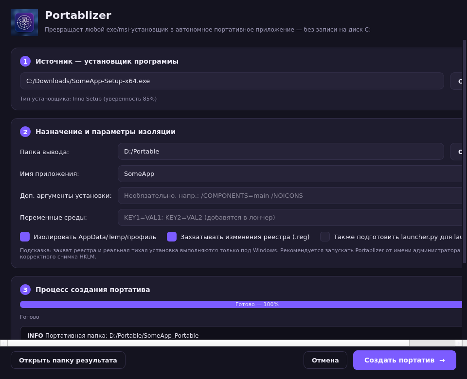

# Portablizer

**Portablizer** — приложение с современным графическим интерфейсом (PySide6/Qt),
которое помогает превратить распространённые **exe/msi-установщики** в
**портативные приложения**, работающие прямо из папки.

Portablizer запускает **тихую установку с перенаправленным пользовательским
окружением** в указанную папку, проверяет фактический результат и учитывает
локальные зависимости и переменные среды. Полная виртуализация Windows не
выполняется, поэтому совместимость зависит от конкретного установщика и
приложения.



## Что делает

1. **Определяет тип установщика** по трём независимым признакам:
   * **структура PE** — настоящий WiX Burn-бандл опознаётся по секции
     `.wixburn`, а не по строке внутри файла (см. «Почему установщик
     определялся неверно» ниже);
   * **байтовые сигнатуры** движков (Inno Setup, NSIS, InstallShield,
     MSI/msiexec, WiX Burn, InstallAware, Wise, install4j, BitRock,
     Advanced Installer, self-extract). Короткие подстроки вроде `nsis`
     считаются **слабыми**: одно такое совпадение понижает уверенность, а
     не решает исход определения;
   * **раскладка диска рядом с установщиком** — `data1.hdr`, `setup.ins`,
     `ISSetup.dll`, соседний `.msi`, готовый `setup.iss`. По ней
     определяется **поколение InstallShield**: у классического
     InstallScript 5/6 и у современной обёртки над MSI командные строки
     несовместимы (см. «Старый InstallShield» ниже);
   * **ключи командной строки, которые установщик содержит внутри себя** —
     так распознаются современные bootstrapper'ы (`--silent`,
     `--installPath`, `--accept-license-agreement`), не относящиеся ни к
     одному классическому движку;
   * **профиль производителя** — у части вендоров (ZennoLab) строки внутри
     сборки упакованы, но имя файла стандартизовано
     (`ZennoPosterLite-RU-v7.9.2.0.exe`), а точный синтаксис тихой
     установки опубликован в официальной документации. Если движок не
     опознан уверенно, ключи берутся из документации производителя.
2. **Строит лестницу команд тихой установки** — не одну «правильную», а
   несколько вариантов от самого точного к самому общему. Portablizer
   выполняет их по очереди и останавливается на первом, который реально
   положил файлы в `App\`. Для **WiX Burn** в лестницу входят повтор без
   ключа `InstallFolder` (не все бандлы объявляют эту переменную, и тогда вся
   команда считается недопустимой) и распаковка бандла через `/layout` с
   последующей административной установкой (`msiexec /a`) извлечённых MSI
   прямо в `App\` — без установки в систему и без прав администратора. Если
   тип опознан ненадёжно, после команды предполагаемого движка автоматически
   идут универсальные наборы ключей (`/VERYSILENT`, `/quiet`, `--silent` …).
   Для **InstallShield** набор команд выбирается по поколению: обёртке над MSI
   уходит `/s /v"/qn INSTALLDIR=\"…\""`, классическому InstallScript —
   `/s /f1"setup.iss" /f2"setup.log" /SMS`.
   Если не сработала ни одна команда, а к exe приклеен ZIP, содержимое
   извлекается напрямую. Весь текстовый вывод установщика (stdout/stderr)
   сохраняется в `installer-output.log` — по нему видно точную причину
   отказа.
3. **Запускает установку тихо и изолированно**: пользовательские каталоги
   (`APPDATA`, `LOCALAPPDATA`, `TEMP`, `USERPROFILE`, `PROGRAMDATA`) на время
   установки перенаправляются внутрь портативной папки.
4. **Захватывает изменения реестра и сортирует их**: снимок HKCU/HKLM\Software
   до и после установки. Разница делится на три группы — настройки программы
   (едут в портатив), интеграция с оболочкой (по желанию) и следы установки
   (в портатив не попадают никогда, см. «Автономность» ниже).
5. **Проверяет результат установки**. Если установщик проигнорировал целевую
   папку, ищет созданную программу в перенаправленном `LocalAppData`, новых
   каталогах `Program Files` и значениях `InstallLocation`, затем переносит её
   в `App/`. Если exe так и не найден, операция завершается ошибкой и сломанный
   `Launch.bat` не создаётся.
6. **Находит главный exe** установленной программы и **собирает зависимости**
   (папки с `.dll` добавляются в `PATH` лончера).
7. **Приносит в портатив распространяемые компоненты (Redistributables)** —
   Visual C++ 2005…2022, DirectX End-User Runtime (июнь 2010), UCRT, OpenAL и
   т. п. Список нужных библиотек читается из **таблиц импорта** самих exe/dll
   (включая отложенный импорт), а файлы берутся из комплекта установщика,
   системных папок этого ПК, WinSxS или официальных пакетов Microsoft.
   Поверх точного списка — по умолчанию — разворачивается **полный комплект
   «про запас»**: все известные версии всех библиотек рядом с каждым exe.
   Это закрывает целый класс ошибок вида «отсутствует `MSVCP110.dll`» и
   «отсутствует `XINPUT1_3.dll`» на чужом компьютере — в том числе для
   плагинов, модов и библиотек, которые программа грузит динамически по
   имени, собранному строкой (см. «Redistributables» ниже). Предусловия
   самого дистрибутива (`vcredist`, `DXSETUP`, OpenAL, PhysX, .NET) при этом
   ставятся **в тихом режиме** ещё до основного установщика: сборка не
   требует нажимать «OK» ни разу.
8. **Генерирует портативные лончеры**: готовый самодостаточный
   `App\LaunchPortable.exe` (основной способ запуска двойным кликом), а также
   запасные `Launch.bat` и `LaunchHidden.vbs`. EXE не требует установленного
   Python: при каждом запуске он воссоздаёт изолированное окружение, подставляет
   настройки, запускает программу и после её закрытия восстанавливает реестр
   компьютера.
9. **Убирает следы установки с вашего ПК**: запись из списка «Установленные
   программы», созданные ярлыки и изменения реестра откатываются, поэтому
   компьютер-сборщик остаётся чистым.

Итоговая структура портатива:

```
MyApp_Portable/
├─ App/
│  ├─ LaunchPortable.exe ← основной запуск портатива двойным кликом
│  └─ ...                ← файлы установленной программы
├─ PortableData/          ← все пользовательские данные (AppData, Temp, реестр)
├─ Launch.bat             ← запасной запуск (чистый ASCII)
├─ LaunchHidden.vbs       ← запасной запуск без окна консоли
├─ Launch_Launcher.exe    ← портативный официальный launcher (если найден)
├─ Launch_Configurator.exe← портативные настройки (если найдены)
├─ Launch_Launcher.bat    ← запасной запуск launcher через cmd
├─ Launch_Configurator.bat← запасной запуск настроек через cmd
├─ Launch_Menu.bat        ← единое меню всех найденных компонентов
├─ launcher_config.json   ← параметры лончера
├─ portable.reg          ← настройки программы (HKCU), путь — маркером
├─ portable_machine.reg  ← настройки HKLM (если были)
├─ cleanup_host.reg      ← откат следов установки на ЭТОМ ПК
├─ cleanup_host.cmd      ← безопасно применяет cleanup_host.reg (сам просит права админа)
├─ redistributables.txt  ← какие системные библиотеки нужны и что уже внутри
├─ Redist/               ← установщики недостающих пакетов Microsoft
│  └─ Install-Redist.cmd ← ставит их МОЛЧА, за один запрос прав администратора
├─ install.log           ← журнал установщика (если поддерживается)
├─ installer-output.log  ← stdout/stderr установщика по каждой попытке
├─ portablizer.log       ← журнал создания и диагностики
└─ README_PORTABLE.txt
```

## Автономность и переносимость с флешки на флешку

Портатив рассчитан на сценарий «скопировал папку на флешку — работает на любом
ПК», без установки. Обычный запуск прав администратора не требует; UAC может
понадобиться только комплектному конфигуратору/лаунчеру старой программы,
который отказывается читать свои обязательные параметры вне HKLM.

**Программа не попадает в список «Установленные программы» чужого ПК.**
Записи ветки `Uninstall` (именно она формирует этот список), автозапуск `Run`,
данные Windows Installer и службы классифицируются как *следы установки* и в
портатив **не переносятся никогда** — переносятся только собственные настройки
программы. Если бы этого разделения не было, портатив при первом же запуске
«устанавливал» бы себя на каждый новый компьютер.

**Компьютер, на котором вы делаете портатив, тоже остаётся чистым.** Тихая
установка — это всё-таки установка, поэтому после сборки Portablizer:

* удаляет программу из списка «Установленные программы»;
* удаляет созданные установщиком ярлыки (меню «Пуск», рабочий стол);
* возвращает изменённые ключи реестра к прежним значениям.

Полный откат сохраняется в `cleanup_host.reg`. Если Portablizer не хватило прав,
он автоматически повторяет импорт через запрос UAC, а рядом кладёт
`cleanup_host.cmd` — запустите **его** (не сам `.reg`): скрипт сам запрашивает
права администратора и применяет откат. Двойной клик по `.reg` запускает regedit
без прав администратора, поэтому ветки `HKLM` не удаляются и Windows показывает
«Не все данные были успешно записаны в реестр». Поведение отключается галочкой
«Убрать следы установки с этого ПК».

**Запуск ничего не оставляет на чужой машине.** Если программе нужны записи
реестра, лончер сначала сохраняет прежнее состояние чужого ПК, затем
подставляет настройки из портатива, а при выходе выгружает изменения обратно в
папку и возвращает реестр как было. Абсолютный путь папки хранится маркером
`@@PORTABLE_ROOT@@`, поэтому смена буквы диска или компьютера ничего не ломает.
Ассоциации файлов и COM по умолчанию не переносятся (галочка «Переносить
ассоциации файлов и COM»).

### Почему установщик определялся неверно (код `-1` и пустая папка `App`)

Строка `WixBurn` внутри exe **не означает**, что перед нами WiX Burn-бандл:
она попадает в любой файл, который просто упоминает этот движок или несёт
Burn-пакет внутри себя. Прежняя версия верила строке, отправляла заведомо
чужому установщику ключи `/quiet /install InstallFolder=…`, тот не понимал
командную строку и завершался с кодом `4294967295` (`-1`, `0xFFFFFFFF`),
ничего не установив.

Теперь тип бандла подтверждается **секцией `.wixburn` в заголовке PE**, а для
установщиков с собственным интерфейсом командной строки ключи берутся из
самого бинарника. Например, установщики ZennoLab требуют

```bat
ZennoPosterLite-RU-v7.9.2.0.exe --silent --accept-license-agreement="https://zennolab.com/terms-of-service/"
```

— и Portablizer подставляет эти ключи (вместе с найденной ссылкой на
лицензию) автоматически, а не угадывает `/quiet`.

Была и вторая ошибка этого же рода. Свежая сборка `ZennoPosterLite` хранит
строки упакованными, поэтому `--silent` в бинарнике не находился, зато
находилась короткая подстрока `nsis` — и установщик получал тип «NSIS,
уверенность 70 %» с единственной командой `/S /D=…`, на которую отвечал
кодом `-1`. Теперь короткая подстрока — **слабая сигнатура**: без сильных
подтверждений («Nullsoft Install System») она лишь понижает уверенность, а
при узнаваемом имени файла продукта ZennoLab подключается **профиль
производителя** — точные ключи берутся из официальной документации
вендора, включая обязательное `--accept-license-agreement="…"` и
`--installType=StandAlone` (чистая установка в папку портатива, а не
обновление уже установленной на этом ПК копии). Если тип опознан ненадёжно,
после команды предполагаемого движка выполняется универсальная лестница
ключей, а вывод установщика (stdout/stderr) попадает в
`installer-output.log`.

Если установка всё же не удалась, вместо «смотрите журнал» выводится разбор
причины и план действий: нужны ли права администратора (проверяется
`requireAdministrator` в манифесте **до** запуска), какие ключи ожидает
установщик, сколько вариантов команды уже испробовано и **чем завершилась
каждая попытка** (код возврата или «код 0, но файлов в App не появилось»).
Тип, угаданный по профилю производителя, показывается честно —
`ZennoLab: Custom CLI bootstrapper`, а не абстрактное «bootstrapper».

### Старый InstallShield (InstallScript 5/6): почему «код 0, а папка пуста»

Диски и программы 1998–2002 годов (например, установщик
*American McGee's Alice*) собраны на **InstallShield InstallScript** —
это не та же программа, что современный `setup.exe` поверх MSI, хотя
сигнатуры внутри файла совпадают. Отличия принципиальны:

| | InstallScript 5/6 | Обёртка над MSI |
|---|---|---|
| тишина | `/s` **только** по файлу ответов | `/s /v"/qn"` |
| целевая папка | из файла ответов, не из командной строки | `INSTALLDIR=…` после `/v` |
| ключ `/v` | не существует | обязателен для параметров MSI |
| журнал | `setup.log` рядом с `setup.iss` (`/f2`) | лог msiexec |

Прежняя версия отправляла в такой установщик команду
`Setup.exe /s "/v/qn INSTALLDIR=… /norestart"`. Движок не понимал `/v`,
выходил через пару секунд **с кодом 0** и оставлял `App/` пустой, а причину
записывал в свой `setup.log`: `ResultCode=-3` — «в файле ответов нет нужных
данных». Portablizer этот журнал не читал и советовал пользователю проверить
лицензию, хотя дело было в командной строке.

Что делает Portablizer теперь:

* определяет **поколение** по раскладке диска и строкам внутри `setup.exe`;
* классическому InstallScript отправляет `/s /f1"…\setup.iss"
  /f2"…\setup.log" /SMS`, а файл ответов и журнал кладёт **в папку
  портатива** — установочный диск (`J:\`) обычно доступен только для чтения,
  и запись рядом с `setup.exe` завершилась бы ошибкой `-7`;
* найденный на диске `setup.iss` копируется в портатив, а путь установки в
  копии заменяется на папку `App` — так программа сразу попадает в портатив
  (оригинал на диске не изменяется);
* если папку задать нечем, программа ставится в каталог по умолчанию и
  **переносится** в `App` сразу же, не дожидаясь конца лестницы;
* `setup.log` читается, и `ResultCode` показывается расшифрованным —
  это точная причина отказа, а не догадка;
* если файла ответов нет, Portablizer прямо пишет, что тихий режим тут
  невозможен, и даёт готовую команду записи:

  ```bat
  "J:\Setup.exe" /r /f1"E:\Portable\Игра_Portable\setup.iss"
  ```

  Записанный `setup.iss` остаётся в папке портатива и подхватывается при
  следующей сборке автоматически — она пройдёт уже без единого окна;
* галочка **«Разрешить окно мастера установки»** делает то же самое без
  ручного запуска: Portablizer сам показывает мастер в режиме записи `/r`,
  сохраняет ответы и забирает установленную программу в портатив. По
  умолчанию она выключена — сборка остаётся полностью автоматической.

### Redistributables: «отсутствует MSVCP110.dll», «XINPUT1_3.dll не найден»

Самая частая причина, по которой правильно собранный портатив не стартует на
чужом ПК, — не программа, а **распространяемые компоненты Microsoft**:

```
Запуск программы невозможен, так как на компьютере отсутствует XINPUT1_3.dll.
Не удалось запустить приложение: отсутствует MSVCP110.dll.
```

Так выглядят `XINPUT1_3.dll`, `d3dx9_38.dll`, `d3dx9_39.dll`, `MSVCP110.dll`,
`MSVCR110.dll`, `MSVCP100.dll`, `MSVCR100.dll` и ещё пара сотен подобных
файлов. Это **не файлы программы**: их ставит в систему `vcredist_x86.exe`
или `DXSETUP.exe`, которые обычный установщик запускает как предусловие. На
компьютере-сборщике они уже есть — и всё работает; на чужом их может не быть.

Portablizer закрывает это **заранее**, на шести уровнях.

**1. Точный список, а не догадки.** У каждого `.exe`/`.dll` в `App`
читается **таблица импорта PE** — обычная и отложенная (delay-load). Именно
по ней загрузчик Windows будет искать файлы, поэтому список получается ровно
тот, который нужен. Отложенный импорт учитывается специально: `XINPUT1_3.dll`
и `xaudio2_7.dll` игры грузят именно так, и ошибка всплывает не при старте, а
в середине игры.

**2. Классификация каждой библиотеки.** Три исхода:

| | что это | что делает Portablizer |
|---|---|---|
| `engine.dll`, `bink2w64.dll` | файлы самой программы | ничего, они уже в папке |
| `kernel32.dll`, `d3d9.dll`, `xinput1_4.dll` | часть Windows | ничего, есть везде |
| `msvcp110.dll`, `d3dx9_39.dll`, `ucrtbase.dll` | распространяемый пакет | приносит в портатив |

Каталог пакетов покрывает Visual C++ 6.0/2002/2003/2005/2008/2010/2012/2013 и
2015–2022 (включая UCRT и заглушки `api-ms-win-crt-*`), DirectX End-User
Runtime июня 2010 (`d3dx9_24…43`, `d3dx10_*`, `d3dx11_*`, `d3dcompiler_33…43`,
`xinput1_1…1_3`, `xaudio2_0…2_7`, `x3daudio1_*`, `xapofx1_*`, XACT), MFC/ATL,
OpenMP, OpenAL, PhysX, VB6-runtime и Games for Windows – LIVE.

**3. Лестница источников** — от самого точного к самому общему:

1. **комплект установщика** — `_CommonRedist`, `redist`, `DirectX`,
   `Prerequisites` рядом с exe установщика (repack-сборки и диски игр почти
   всегда несут нужные версии с собой; при необходимости `.cab` и `.msi`
   распаковываются через `expand`/`msiexec /a` без установки в систему);
2. **системные папки этого ПК** — `System32`/`SysWOW64` с **обязательной
   проверкой разрядности**: 64-битный `msvcp100.dll` 32-битной игре не просто
   бесполезен, а вреден;
3. **WinSxS** — для VC++ 2005/2008, которые живут только там. Рядом с
   программой создаётся **private-манифест сборки** (`Microsoft.VC90.CRT.manifest`)
   с той версией, которую запрашивает манифест самой программы, иначе Windows
   проигнорирует копию рядом с exe и скажет «параллельная конфигурация
   неправильна»;
4. **официальные пакеты Microsoft** — только если включена галочка
   «Скачивать недостающие пакеты»: сборка не ходит в сеть без спроса.

Найденные файлы кладутся **рядом с каждым исполняемым файлом, который их
запрашивает**, — это единственное место, которое загрузчик Windows проверяет
всегда. Библиотеки, спрятанные установщиком в служебную подпапку
(`App\redist\msvcr110.dll`), тоже дублируются к exe. К заглушкам
`api-ms-win-crt-*` автоматически докладывается `ucrtbase.dll`: без него они
бесполезны на Windows 7/8.1. Из одного пакета достаются **все** заказанные
библиотеки: если программе нужны и `d3dx9_38.dll`, и `d3dx9_39.dll`, оба
кабинета из `directx_Jun2010_redist.exe` будут развёрнуты.

**3a. Собственный распаковщик кабинетов — распаковка больше ни от кого не
зависит.** Раньше пакет вскрывался чужими руками: Portablizer запускал сам
`vcredist_x86.exe` с ключом распаковки (`/T:`, `/x:`, `/layout`) или звал
`expand`. Это срывалось по причинам, которые от Portablizer не зависят:
пакет разбирает путь **сам, внутри одного аргумента** (пробел обрывает
путь, кириллица в профиле пользователя разбирается как мусор, длинный путь
упирается в MAX_PATH), запуск чужого exe может быть запрещён политикой или
антивирусом, а `expand` может отсутствовать в PATH. Отсюда и брались
сообщения «пакет скачан, но распаковать его автоматически не удалось».

Теперь в `portablizer/core/cabinet.py` живёт **свой читатель CAB**: все эти
пакеты — это PE с приклеенными кабинетами (`MSCF`), и они читаются
напрямую, штатным `zlib` (MSZIP — это deflate с историей между блоками).
Ничего не запускается, никаких путей в командной строке:

* `vcredist_x86.exe` VC++ 2005/2008/2010 — обёртка IExpress: внутри
  `vc_red.msi` и `vc_red.cab`, вложенный кабинет раскрывается рекурсивно;
* `vcredist_x86.exe` VC++ 2012/2013 и `vc_redist.x64.exe` 2015–2022 —
  бандлы WiX Burn: к PE приклеено несколько контейнеров, и это тоже
  кабинеты;
* `directx_Jun2010_redist.exe` — снова IExpress: оттуда достаётся
  `DXSETUP.exe` и нужные кабинеты;
* `.cab` и `.msi` рядом с установщиком игры — так же, без `expand` и без
  `msiexec /a` (и, значит, без прав администратора).

Внешние инструменты остались **запасными** ступенями: запуск пакета с
ключом по его движку (`/Q /C /T:` для wextract, `/layout` для Burn,
`msiexec /a` для MSI) в путь без пробелов и не-ASCII (короткое имя 8.3,
иначе временная папка, иначе `%PUBLIC%`), затем `expand`/`extrac32`
(по абсолютному пути в `System32`, а не по PATH) и 7-Zip, если он есть.
Они нужны только для редких кабинетов LZX/Quantum.

Дополнительно к этому:

* **скачанное проверяется**: если по ссылке пришла HTML-страница, редирект
  или обрывок, это видно сразу (сигнатура `MZ`/`MSCF`/MSI и разумный
  размер), и Portablizer берёт **запасную ссылку** — у каждого пакета
  VC++ 2005–2013 их теперь минимум две. Сообщение тоже честное: «сервер
  вернул веб-страницу вместо файла», а не «распаковать не удалось»;
* библиотеки внутри `vc_red.cab` лежат под «складскими» именами таблицы
  File установщика (`FL_mfc80_dll_01_8.0.50727.762_x-ww_…`), и поиск
  распакованного это учитывает — иначе `mfc80.dll` «не находился» в
  полностью распакованном пакете;
* у VC++ 2005 SP1 прописаны прямые ссылки на официальные пакеты
  (MFC Security Update, 8.0.50727.6195) — именно в них лежат `mfc80.dll`,
  `mfc80u.dll` и `atl80.dll`;
* private-манифест сборки для VC++ 2005/2008 создаётся **независимо от
  источника файла** (WinSxS, System32 или распакованный `vcredist`): без
  него Windows игнорирует копию рядом с exe.

**3b. DirectX ставится в два шага.** `directx_Jun2010_redist.exe` — не
установщик, а архив: любой ключ тихого режима он передаёт вложенному
`DXSETUP.exe`, а тот знает ровно один (`/silent`) и на всё остальное
отвечает модальным окном «Установка DirectX — Неверная операция командной
строки». Поэтому бандл сначала **распаковывается** (своим читателем
кабинетов — сам бандл при этом даже не запускается), и только потом
запускается `DXSETUP.exe /silent` — и при сборке, и в
`Redist\Install-Redist.cmd`, и в `LaunchPortable.exe` на целевом ПК.

**4. Полный комплект «про запас» — по умолчанию.** Таблица импорта отвечает
на вопрос «что программа требует точно», но не видит библиотек, которые
грузятся динамически по имени, собранному строкой (игры делают так с
`d3dx9_%d.dll`), подключаются плагинами и модами или оказываются нужны после
того, как установщик докачал компонент. Поэтому Portablizer заранее
раскладывает рядом с каждым exe **весь каталог известных библиотек**: все
версии Visual C++ 2005–2022 (`MSVCP100.dll`, `MSVCR100.dll`,
`MSVCP110.dll`, `MSVCR110.dll`, `msvcp140.dll`, MFC/ATL/OpenMP…), весь
DirectX End-User Runtime (`XINPUT1_3.dll`, `d3dx9_24…43.dll`,
`d3dx10/11_*`, `d3dcompiler_*`, `xaudio2_*`, XACT, `x3daudio1_*`,
`xapofx1_*`), старые runtime'ы VC6/2002/2003, OpenAL, PhysX, VB6-runtime и
даже `xlive.dll` — всего около 180 файлов на разрядность. Файлы берутся из
тех же источников, что и обязательные; то, чего на компьютере сборки нет,
просто пропускается. Такой портатив больше на десятки мегабайт, зато окно
«отсутствует dll» не возникает **в принципе**. Ненайденное «про запас»
ошибкой не считается: оно попадает в отдельный раздел отчёта
`redistributables.txt` и не попадает в предстартовую проверку лончера —
пользователь не получит предупреждение о файле, который программа,
скорее всего, вовсе не просит.

**5. Честный остаток.** Если файл не нашёлся нигде, Portablizer не делает
вид, что всё хорошо:

* в корне портатива появляется `redistributables.txt` — что нужно, что уже
  внутри, что придётся поставить, с прямыми ссылками на пакеты Microsoft;
* список попадает в `launcher_config.json`, и **лончер проверяет его перед
  запуском**: если на этом ПК библиотеки действительно нет, пользователь
  увидит название пакета и ссылку, а не системное окно «отсутствует
  MSVCR110.dll». Проверка не отменяет запуск — часть компонентов нужна не
  всегда;
* в GUI по окончании сборки выводится и список принесённого, и список
  недостающего.

**6. Тихая установка пакетов — без единого «OK».** Установщик игры почти
всегда сам запускает свои предусловия: `vcredist_x86.exe`, `DXSETUP.exe`,
`oalinst.exe`, PhysX, .NET. Каждый из них показывает своё окно и ждёт
нажатия «OK» — так ведёт себя, например, первый «Ведьмак», и автоматическая
сборка превращается в сидение у экрана. Portablizer делает это сам и молча:

* **перед** запуском основного установщика все опознанные пакеты из
  `_CommonRedist`, `redist`, `DirectX`, `Prerequisites` ставятся в тихом
  режиме (`/install /quiet /norestart` для WiX Burn, `/q` для
  IExpress-обёрток VC++ 2005–2010, `/silent` для DXSETUP, `/S` для NSIS,
  `/VERYSILENT` для Inno Setup, `msiexec /qn` для MSI, `wusa /quiet` для
  MSU). Мастер основной установки видит их уже установленными и проходит
  этот шаг без окон;
* ключи подбираются **лестницей**: сначала те, что положены движку
  (движок определяется по имени файла и по сигнатурам внутри него), затем
  общие. Коды `1638`/`5100` («уже установлено») и `3010`/`1641` («нужна
  перезагрузка») считаются успехом, а не ошибкой;
* запускается **только белый список** известных распространяемых пакетов.
  Произвольный `setup.exe` из папки дистрибутива Portablizer молча не
  выполняет — это чужой код с правами администратора;
* тихая установка работает и как **последняя ступень лестницы источников**:
  если библиотеки нет ни в комплекте, ни на этом ПК, ни в WinSxS и её не
  удалось достать распаковкой, пакет ставится в систему молча, а файлы
  забираются уже из `System32`/`WinSxS` в портатив;
* всё, что принести так и не удалось, страхуется на целевом ПК: установщики
  складываются в папку `Redist` вместе со скриптом `Install-Redist.cmd`
  (один запрос UAC, дальше — тишина), а `LaunchPortable.exe` запускает его
  сам, когда видит, что библиотеки на этом компьютере нет. Сообщение
  пользователю остаётся только на случай, когда тихая установка невозможна
  (нет установщика, отказ UAC).

Поведение отключается галочкой **«Ставить redistributables молча (без окон
с “OK”)»** — тогда Portablizer ничего не устанавливает в систему и ведёт
себя как раньше. Для установки пакетов нужны права администратора, поэтому
запускайте Portablizer «от имени администратора».

Проверка и перенос отключаются галочкой «Встраивать Visual C++ / DirectX в
портатив» (по умолчанию включена). Полный комплект «про запас» отключается
галочкой «Полный комплект библиотек (все версии VC++ и DirectX)» (по
умолчанию включена) — тогда рядом с exe ложится только то, что требует
таблица импорта. Файлы VC++ Runtime разрешено распространять вместе с
программой — см. условия лицензии Visual Studio.

### Почему сборка «зависала на 82%» и что теперь видно

Этап «Распространяемые компоненты (VC++, DirectX)» — самый долгий: пакет
`directx_Jun2010_redist.exe` весит около 98 МБ, а внутри него почти сотня
кабинетов. Раньше на время загрузки и распаковки интерфейс замирал: общая
полоса стояла на 82%, в журнале висела одна строка «Скачиваю DirectX
End-User Runtime…», и сборка выглядела мёртвой.

Теперь ход работ виден постоянно:

* **вторая полоса прогресса** под общей показывает текущую операцию —
  `Скачиваю DirectX End-User Runtime (июнь 2010): 41.3 МБ из 98.2 МБ,
  3.1 МБ/с, осталось ~0:18 — 42%`;
* если сервер не сообщил размер файла, полоса становится «бегущей», а не
  замирает на нуле;
* **общая полоса** внутри этапа 82 → 87% движется по мере разбора
  библиотек (`Компоненты: d3dx9_43.dll (14 из 62)`);
* **распаковка** кабинетов тоже считается: `Распаковываю
  Jun2010_d3dx9_43_x86.cab (14 из 97)`;
* в журнал каждые 5% пишется строка о ходе загрузки — её видно и в
  `portablizer.log`;
* тихая установка показывает прошедшее время и предел ожидания, чтобы
  отличить долгую работу от настоящего зависания.

Заодно загрузка стала честнее: обрыв соединения (получено меньше, чем
обещал `Content-Length`) считается ошибкой, файл-огрызок удаляется, и
Portablizer переходит к запасной ссылке, а не пытается распаковать
половину пакета. Кнопка «Отмена» прерывает и загрузку тоже.

### Почему `Launch.bat` раньше «мигал и закрывался»

cmd.exe читает .bat не построчно, а блоками, запоминая **байтовое** смещение.
Прежний лончер вызывал `chcp 65001` и содержал русский текст в комментариях —
после смены кодовой страницы смещение «съезжало», интерпретатор начинал читать
команды с середины строки и молча завершался, не дойдя до запуска программы.

Теперь `Launch.bat` **строго ASCII** и не вызывает `chcp`; генератор проверяет
это и падает с ошибкой, если не-ASCII символ просочился в шаблон. Имена файлов
с кириллицей подставляются не литералом, а маской `?`, которую cmd раскрывает
через файловую систему.

### Почему программа могла падать с «Internal error 0x06: System error!»

Некоторые программы (особенно игры со Steam-эмулятором, как в repack-сборках)
создают свой каталог данных внутри папки профиля без предварительного создания
промежуточных директорий. Когда лончер перенаправлял профиль в `PortableData`,
но нужной подпапки (`Documents\My Games`, `Public\Documents` и т.п.) там ещё не
было, программа падала с невнятной ошибкой вроде `Internal error 0x06`.

Теперь лончер заранее создаёт полное дерево профиля — `Documents`,
`Documents\My Games`, `Saved Games`, `Public\Documents`, `AppData\LocalLow` и
другие стандартные каталоги, — поэтому такие программы стартуют без ошибки.

### Комплектные лончеры, конфигураторы графики и выбор языка

Во многих играх и профессиональных программах (The Witcher, серии Fallout/Elder Scrolls,
репаки с внешними конфигураторами) настройки языка, озвучки, разрешения экрана и качества
графики меняются не внутри самого exe игры, а в **комплектном лончере** (`Launcher.exe`) или
**утилите конфигурации** (`Configurator.exe`, `Settings.exe`, `Language_Setup.exe`).

Раньше портативные сборщики либо запускали только основной exe в обход лончера (и пользователь
терял возможность настроить графику/язык), либо при запуске через `Launcher.exe` настройки
сбрасывались, потому что лончер пытался писать в ветку `HKLM\Software\...`, не имел прав
администратора на чужом ПК или не видел реестровых записей.

Portablizer решает эту проблему комплексно:

1. **Автоматическая классификация исполняемых файлов**:
   - `main` — главный исполняемый файл игры/программы;
   - `launcher` — комплектный предстартовый лончер;
   - `config` — утилита настройки графики, звука, управления или языка;
   - `tool` — дополнительные вспомогательные утилиты.

2. **Только полезные варианты запуска, без десятка дубликатов**:
   - `App\LaunchPortable.exe` — прямой запуск основной программы;
   - `Launch_Launcher.exe` — комплектный лончер (если найден);
   - `Launch_Configurator.exe` — окно настроек (если найдено);
   - одноимённые `.bat` — запасные варианты для диагностики;
   - `Launch_Menu.bat` — все найденные компоненты, включая редкие утилиты.

   Дополнительные EXE — копии самодостаточного portable-лончера, а не ярлыки
   на абсолютный путь. Имя копии сопоставляется с относительным путём цели в
   `launcher_config.json`; поэтому они продолжают работать после переноса на
   другую флешку и запускают `Launcher.exe`/`Configurator.exe` с теми же
   `PortableData`, перенаправленными Documents, окружением и реестром, что и
   основная программа.

   Отдельные `Launch_PerformanceTester.bat`, `Launch_userContentManager.bat` и
   парные VBS для каждой служебной утилиты больше не создаются: они только
   загромождали папку, а всё нужное уже есть в едином меню.

3. **Реальный каталог установки для старых игр**. Если установщик сначала
   положил игру в `Program Files`, а Portablizer затем перенёс её в `App`,
   захваченные `InstallFolder`/`InstallDir` также перенаправляются в `App`.
   Поэтому Launcher/Configurator больше не считают перенесённую игру
   «неустановленной».

4. **HKLM с безопасным fallback**:
   - машинные ключи дублируются в VirtualStore/HKCU для программ без manifest;
   - manifest-aware программы (в том числе некоторые старые игровые лаунчеры)
     игнорируют VirtualStore. Только при запуске такого вспомогательного файла
     Portablizer показывает UAC, временно импортирует `portable_machine.reg`,
     ждёт закрытия окна, сохраняет изменения и возвращает HKLM как было;
   - обычный запуск самой игры UAC не требует.

5. **Общие портативные «Документы»**. Одной переменной `USERPROFILE` для .NET и
   WinAPI недостаточно: они получают Documents через `SHGetKnownFolderPath`.
   На время работы лончер безопасно перенаправляет Known Folder в
   `PortableData\User\Documents`, а затем восстанавливает исходное значение.
   Поэтому `Configurator.exe` и игра читают один и тот же
   `Documents\Witcher 2\Config\User.ini`.

Для The Witcher 2 рекомендуемый порядок: один раз открыть
`Launch_Configurator.exe` (разрешить UAC, если он появится), выбрать графику и
закрыть конфигуратор; затем играть через `App\LaunchPortable.exe` или
`Launch.bat`. Настройки останутся внутри портативной папки и будут применены
игрой. Не запускайте `App\bin\Configurator.exe` двойным щелчком: это
оригинальный файл, а не portable-обёртка. В таком случае ему не передаются
перенаправленные профиль и реестр, поэтому The Witcher 2 закономерно сообщает
`Could not find valid The Witcher 2 installation`.

Запускайте `Launch_Configurator.exe` или `Launch_Launcher.exe` из корня
портативной папки, а не оригинальные файлы внутри `App`. Оконные EXE сами
показывают UAC только при наличии обязательного захваченного HKLM и корректно
ждут завершения вспомогательной программы. Одноимённые `.bat` сохранены как
диагностический запасной вариант.

Основной запуск не требует `.bat`: откройте папку `App` и запустите
`LaunchPortable.exe`. Это настоящий Windows EXE, уже собранный вместе с
Portablizer; он читает общий `launcher_config.json`, поэтому сохраняет изоляцию
профиля и реестра. Он также понимает `--launcher`, `--config` и `--target`.
Прямой запуск оригинального exe программы обходит изоляцию.

Ключи запасного `Launch.bat`:

```bat
Launch.bat                      :: обычный запуск основного приложения
Launch.bat --launcher           :: запустить комплектный лончер (если есть)
Launch.bat --config             :: запустить конфигуратор настроек/языка
Launch.bat --menu               :: открыть интерактивное меню выбора
Launch.bat --target "App\x.exe" :: запустить конкретный exe с изоляцией
Launch.bat --list               :: показать все найденные исполняемые файлы
Launch.bat --nopause            :: не ждать нажатия клавиши
Launch.bat --no-registry        :: вообще не трогать реестр
Launch.bat --keep-registry      :: оставить настройки в реестре после выхода
Launch.bat --reset              :: забыть сохранённые настройки
Launch.bat --help               :: справка
Launch.bat -- --arg1 --arg2     :: передать аргументы самой программе
```

### Старые игры: «лончер закрылся, и ничего не произошло» (код 1)

Классический случай — **The Witcher (GOG)**. Игра ведёт себя так:

* `witcher.exe` читает путь установки и язык из **HKLM**
  (`Software\[Wow6432Node\]CD Projekt Red\The Witcher`). Если ключа нет, exe
  завершается сразу с кодом `1` и без единого сообщения — именно это видно в
  выводе `Launch.bat`: `[WARNING] The program exited with code 1.`
  Подмена через `VirtualStore` работает только для программ **без манифеста**,
  поэтому её одной недостаточно.
* `Launcher.exe` по кнопке «Launch game» **запускает игру и тут же
  завершается**. Раньше лончер портатива считал это завершением сеанса,
  немедленно возвращал реестр хоста в исходное состояние и убирал
  перенаправление профиля — игра, стартовавшая секунду назад, теряла свои
  ключи установки и молча умирала.

Что делают лончеры теперь:

1. **Проверяют захваченные ключи HKLM перед запуском любой цели** (не только
   лончера и конфигуратора). Если на этом ПК их нет, а рядом лежит
   `portable_machine.reg`, однократно запрашивается UAC и файл импортируется
   по-настоящему; при отказе от UAC запуск продолжается на старом
   `VirtualStore`-варианте, а не прерывается.
2. **Ждут завершения программ, запущенных из портативной папки.** После выхода
   прямой цели даётся несколько секунд на появление дочернего процесса (игры),
   и реестр восстанавливается только тогда, когда из папки больше ничего не
   выполняется.
3. **Пишут журнал** `PortableData\launcher-run.log`: что было запущено, с каким
   рабочим каталогом, какие `.reg` импортированы, с каким кодом завершилась
   программа и сколько ждали дочерние процессы. Это первое, что стоит смотреть,
   если игра снова не стартует.

Полезные проверки вручную: `Launch.bat --list` (та ли цель выбрана главной),
`Launch.bat --pause` (видеть вывод) и `Launch.bat --target "App\System\witcher.exe"`.

## Запуск из исходников

```bash
pip install -r requirements.txt
python app.py
```

> На Linux/macOS приложение запускается и полностью работает интерфейс, но
> реальная тихая установка и захват реестра выполняются **только под Windows**
> (на других ОС — безопасный демо-режим).

## Сборка Windows-исполняемого файла (.exe)

### Вариант A — локально на Windows
Нужен установленный Python 3.10+ (с python.org, галочка «Add to PATH»):

```bat
build.bat
```

Результат: `dist\Portablizer.exe` — один самодостаточный файл без консоли.
`build.bat` сначала собирает универсальный `PortableLauncher.exe`, а затем
встраивает его в Portablizer; при создании портатива этот ресурс копируется как
`App\LaunchPortable.exe`.

### Вариант B — через GitHub Actions (без своего Windows)
В репозитории настроен workflow `.github/workflows/build-windows.yml`. Он
собирает `Portablizer.exe` на настоящем раннере `windows-latest` при каждом
push в ветку `arena/**` и публикует артефакт **Portablizer-windows-x64**.

Скачать готовый exe:
1. Вкладка **Actions** → последний запуск **Build Windows EXE**.
2. Раздел **Artifacts** → **Portablizer-windows-x64**.

Или через CLI: `gh run download --name Portablizer-windows-x64`.

## Рекомендации по использованию

- Запускайте Portablizer **от имени администратора** — это нужно и для снимка
  ветки `HKLM`, и для установки программ с повышенными правами, и для полной
  очистки следов установки с вашего компьютера.
- Проверить готовый портатив проще всего так: скопируйте папку на флешку,
  откройте её на другом ПК и запустите `App\LaunchPortable.exe`. Программы не
  должно быть в списке «Установленные программы» этого компьютера ни до, ни
  после запуска. `Launch.bat` в корне остаётся запасным способом запуска.
- Если установщик не распознан или после установки в `App/` нет exe, проверьте
  `portablizer.log`/`install.log` и задайте ключи вручную в поле **«Доп.
  аргументы установки»**. Portablizer больше не считает пустую `App/` успешным
  результатом и не создаёт в таком случае заведомо сломанный `Launch.bat`.
  Сообщение об ошибке подсказывает конкретные ключи для вашего установщика.
- Некоторые установщики **принципиально** не поддаются портативизации: если
  программа требует входа в аккаунт, активации лицензии на конкретный ПК или
  установки системной службы, тихая установка в чужую папку невозможна —
  Portablizer честно сообщит об этом вместо создания нерабочей папки.
- MSI обрабатывается административной распаковкой (`msiexec /a`) в `App/`, а не
  обычной системной установкой (`/i`).
- Установщик с компакт-диска или смонтированного образа лучше **скопировать на
  жёсткий диск** и собирать портатив из копии: старым InstallShield нужно место
  рядом с `setup.exe`. Portablizer предупреждает, если носитель только для
  чтения.
- Собирайте портатив на компьютере, где нужные программе пакеты Visual C++ и
  DirectX **уже установлены**: тогда Portablizer возьмёт файлы прямо оттуда и
  на чужом ПК ничего ставить не придётся. Полный комплект «про запас» (все
  версии VC++ и весь DirectX июня 2010) включён по умолчанию, поэтому на
  такой машине рядом с exe окажется сразу всё; недостающее видно в
  `redistributables.txt`. Если такого ПК нет — включите «Скачивать
  недостающие пакеты», и файлы будут взяты с сайта Microsoft.
- Полная виртуализация реестра/файловой системы (как в ThinApp/Cameyo) не
  выполняется: применяется практичная модель — перенаправление пользовательских
  каталогов + импорт захваченного `.reg`. Это покрывает подавляющее большинство
  обычных приложений.

## Архитектура

```
portable_launcher_entry.py ← логика самодостаточного App/LaunchPortable.exe
portable_launcher.spec     ← его отдельная Windows-сборка
portablizer/
├─ core/
│  ├─ detect.py       ← тип установщика: секции PE + сигнатуры + его ключи
│  ├─ silentargs.py   ← лестница команд тихой установки по движку
│  ├─ registry.py     ← снимок/diff реестра → .reg (только Windows)
│  ├─ redist.py       ← импорты PE + полный комплект VC++/DirectX + отчёт
│  ├─ cabinet.py      ← свой распаковщик CAB (vcredist/DirectX без expand)
│  ├─ launcher.py     ← генерация Launch.bat / launcher.py / config
│  ├─ portablizer.py  ← оркестратор всего процесса
│  └─ logutil.py      ← потокобезопасный логгер
└─ gui/
   ├─ main_window.py  ← главное окно (PySide6)
   ├─ worker.py       ← фоновый поток (QThread)
   └─ style.py        ← тёмная тема (QSS)

tests/
├─ batsim.py              ← мини-интерпретатор cmd.exe
├─ pebuild.py             ← генератор настоящих PE-файлов для тестов
├─ cabbuild.py            ← генератор настоящих кабинетов и пакетов
├─ test_cabinet.py        ← свой распаковщик CAB
├─ test_redist.py         ← распространяемые компоненты (VC++, DirectX…)
└─ test_portablizer.py    ← тесты, в т.ч. реальное исполнение Launch.bat
```

### Тесты

```bash
python -m unittest discover -s tests -v
```

`tests/batsim.py` — интерпретатор подмножества cmd.exe (метки, `goto`/`call`,
`if`/`for`, подстановка переменных, `%~dp0`). Он **исполняет** сгенерированный
`Launch.bat` и проверяет, что тот доходит до запуска программы. Именно так
ловится исходная регрессия: старый лончер с `chcp` и кириллицей интерпретатор
отвергает, новый — проходит на путях с пробелами, `&` и любой буквой диска.

`tests/pebuild.py` собирает **настоящие** PE-файлы (таблица импорта,
отложенный импорт, ресурс `RT_MANIFEST`, x86/x64), поэтому разбор
зависимостей проверяется на структуре, а не на строке `MZ` с мусором. Так
тесты гарантируют, что `XINPUT1_3.dll`, `d3dx9_38/39.dll`, `MSVCP110.dll`,
`MSVCR110.dll`, `MSVCP100.dll` и `MSVCR100.dll` опознаются, переносятся в
портатив и — если файла нет нигде — называются по имени пакета в `Launch.bat`,
`launcher_config.json` и `redistributables.txt`.

Отдельно закрыты регрессии этого релиза:

* exe, который лишь **упоминает** `WixBurn`, больше не считается Burn-бандлом,
  а настоящий бандл (секция `.wixburn` в PE) по-прежнему определяется верно;
* ключи берутся из самого установщика, включая ссылку на лицензию;
* лестница попыток останавливается на первом варианте, давшем файлы, и
  не считает успехом код возврата `0` при пустой папке `App`;
* поле «Доп. аргументы установки» больше не рвёт аргументы с буквой «t»
  (`--silent` превращался в `--silen`: разделителем по ошибке считался
  обратный слеш и сама буква).

## Лицензия

MIT.
